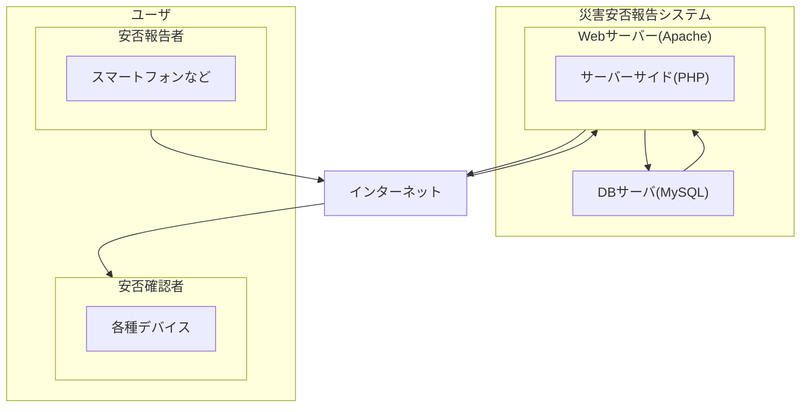

# SystemDev_TeamL

## システム開発授業のためのリポジトリ

本リポジトリはシステム開発授業のソースコード管理のためのリポジトリです。念のための履歴等管理用リポジトリとなります。基本的にはTeamsでのコード共有方針です。

## ディレクトリ構成

```

01_frontend
  pages/
    assets/
    public/
      admin_php（管理者用ページ）/
        admin_menu.php(管理者用メニュー)
        employee_list.php(社員一覧画面)
        employee_detail.php(社員詳細画面)
        safety_delete.php(安否情報削除)
      safety_php(安否情報ページ)/
        safety_register.php(安否登録画面)
        safety_list.php(社員安否一覧画面)
        safety_detail.php(安否詳細画面)
      login.php(ログイン画面)
    styles/
      admin_css(管理者用ページ別CSS)/
        admin_menu.css
        employee_list.css
        employee_detail.css
        safety_delete.css
      safety_css(安否情報ページ別CSS)/
        safety_register.css
        safety_list.css
        safety_detail.css
      login.css
      reset.css(CSS表示の統一)
      style.css(ベースのCSS)
02_backend/
03_db/
README.md

```

## システム機能一覧と実装目安について

### 技術スタック（予定）

| **技術名**    | **内容**               |
| ---------- | -------------------- |
| HTML       | 表示処理                 |
| CSS        | スタイリング               |
| JavaScript | 動的なWebサイト作成（必要に応じて）  |
| PHP        | データベースとの連携、サーバーサイド処理 |
| MySQL      | データベース               |

## システム構成



## フォントについて

念のために可読性を重視したUD（ユニバーサルデザイン）フォントに統一しています。

フォントの太さについて

通常（Regular）：font-weight: 400;

太字（Bold）:font-weight: 700;

となっています。

フォントに関しては、表示の差異が出るのを避けるため、ttfファイルをディレクトリ内に同梱して設定しています。

