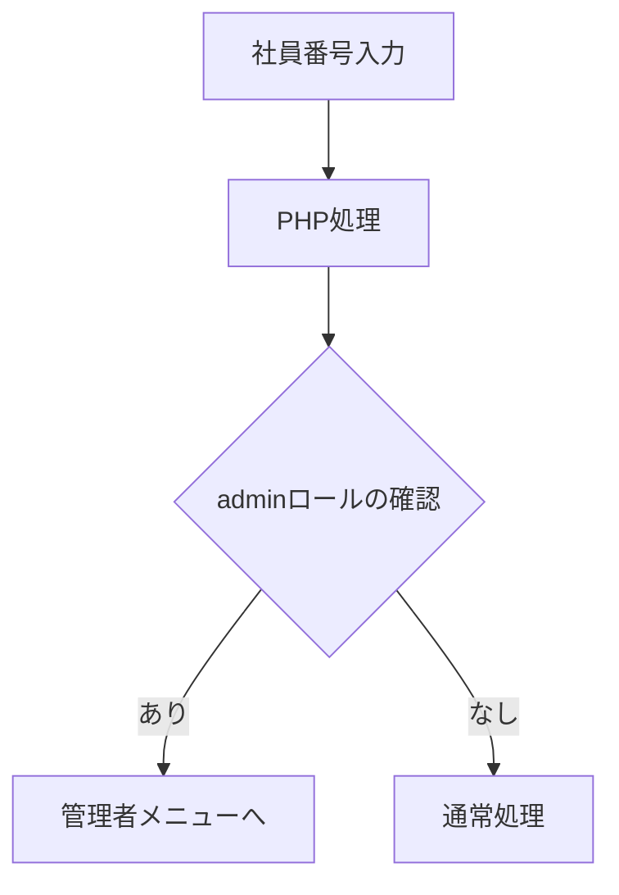

ファイル・フォルダ名は基本的にはスネークケースです。

```plaintext
(例)：スネークケース　→　snake_case (アンダースコアで区切るタイプ)

```

## CSSクラス等(慣例に則ってケバブケース)

```plaintext
(例)：ケバブケース　→　kebab-case (ハイフンで区切るタイプ)

```

| パーツ | クラス名 |
| --- | --- |
| ロゴ（災害安否報告システム） | logo |
| ログアウトボタン | logout-btn |
| メニューバー | menu-bar |

## テーブル定義

命名規則は基本的にスネークケースとする。

| **テーブル名** | **分類** | **概要** |
| --- | --- | --- |
| 社員表 | マスタ | ユーザ情報、連絡先、所属部署および管理者ロール |
| 部署表 | マスタ | 部署情報 |
| 安否報告情報 | トランザクション | 安否報告、投稿日時、ケガ、出社可否 |
- マスタテーブルの削除：物理削除ではなく論理削除
- トランザクションテーブル：物理削除※記録データは帳票出力（CSV）
- パスワードはハッシュ化、データのマスクを行い保存
- 全テーブルに作業者のユーザID、登録日時の属性を付与

### 社員表（EMPLOYEE※略：emp）

分類：マスタ

削除処理：論理削除

※部署番号と連動してadminロールを付与

emp_idは主キーにする

| 項目名 | 説明 | 属性 | 型 | 桁数 | NULL | キー |
| --- | --- | --- | --- | --- | --- | --- |
| emp_id | 社員ID |  |  |  |  | PRIMARY |
| emp_name | 社員名 |  |  |  |  |  |
| emp_tel | 社員電話番号 |  |  |  |  |  |
| emp_worker_id | 作業者ID（社員管理） |  |  |  |  |  |
| emp_work_timestamp | 登録日時（社員管理） |  |  |  |  |  |

### 部署表（DEPARTMENT※略：dept）

分類：マスタ

削除処理：論理削除

emp_idを主キーとして統合

| 項目名 | 説明 | 属性 | 型 | 桁数 | NULL | キー |
| --- | --- | --- | --- | --- | --- | --- |
| emp_id | 社員ID |  |  |  |  | PRIMARY |
| dept_id | 部署番号 |  |  |  |  |  |
| dept_name | 部署名 |  |  |  |  |  |
| dept_position | 役職 |  |  |  |  |  |
| dept_role | 管理者ロール（システム管理部は管理者、それ以外はユーザ） |  |  |  |  |  |
| dept_worker_id | 作業者ID（部署管理） |  |  |  |  |  |
| dept_work_timestamp | 登録日時（部署管理） |  |  |  |  |  |

### 安否確認情報（SAFETY※略：safe）

分類：トランザクション

削除処理：物理削除だが帳票出力の必要あり

emp_idを主キーとして統合

| 項目名 | 説明 | 属性 | 型 | 桁数 | NULL | キー |
| --- | --- | --- | --- | --- | --- | --- |
| emp_id | 社員ID |  |  |  |  | PRIMARY |
| safe_info | 安否報告情報 |  |  |  |  |  |
| safe_timestamp | 安否報告投稿日時 |  |  |  |  |  |
| safe_state | ケガ |  |  |  |  |  |
| safe_propriety | 出社可否 |  |  |  |  |  |
| safe_worker_id | 作業者ID（安否情報管理） |  |  |  |  |  |
| safe_work_timestamp | 登録日時（安否情報管理） |  |  |  |  |  |

### 認証情報（AUTH※auth）

emp_idを主キーとして統合

| 項目名 | 説明 | 属性 | 型 | 桁数 | NULL | キー |
| --- | --- | --- | --- | --- | --- | --- |
| emp_id | 社員ID |  |  |  |  | PRIMARY |
| auth_password | パスワード |  |  |  |  |  |
| auth_worker_id | 作業者ID（認証情報管理） |  |  |  |  |  |
| auth_work_timestamp | 登録日時（認証情報管理） |  |  |  |  |  |

【処理フロー】

PHP：社員番号入力→employeeテーブルからadminロールがあるか判断

ありの場合：管理者メニューへ

なしの場合：通常処理（安否登録画面に遷移）

